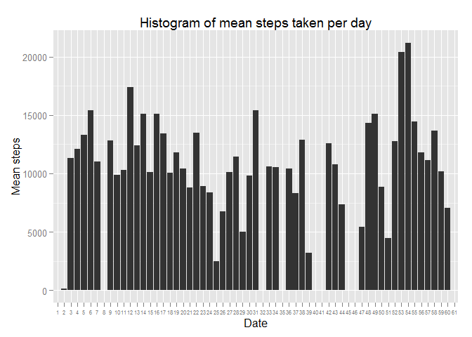
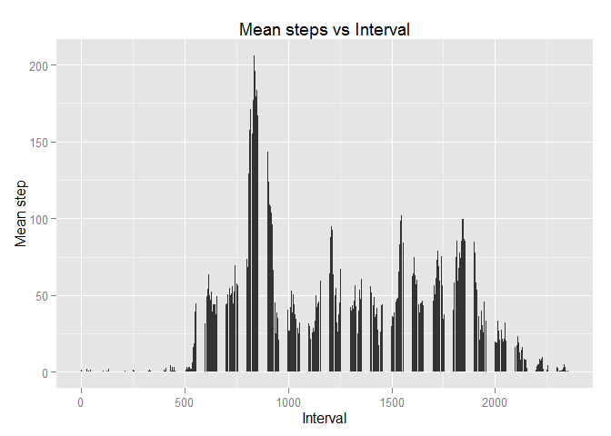
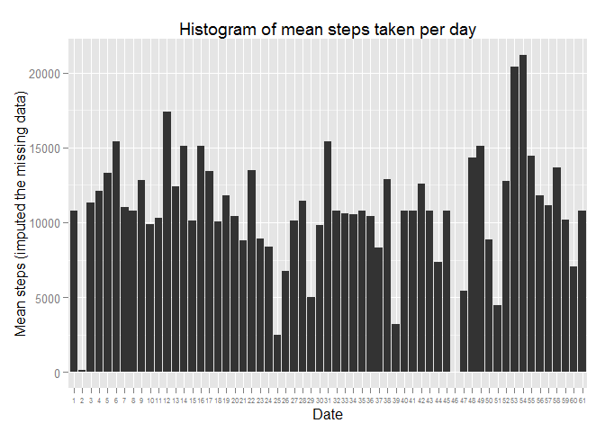
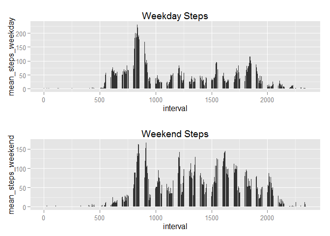

# Reproducible Research: Peer Assessment 1


## Loading and preprocessing the data
Load the data and necessary packages

```r
act_data <- read.csv("activity.csv", header = TRUE)
library(plyr)
library(ggplot2)
```
Here is a summary of the dataset:

```r
str(act_data)
```

```
## 'data.frame':	17568 obs. of  3 variables:
##  $ steps   : int  NA NA NA NA NA NA NA NA NA NA ...
##  $ date    : Factor w/ 61 levels "2012-10-01","2012-10-02",..: 1 1 1 1 1 1 1 1 1 1 ...
##  $ interval: int  0 5 10 15 20 25 30 35 40 45 ...
```

## What is mean total number of steps taken per day?
Ignoring the missing values, a histogram is plotted use ggplot: 

```r
ggplot(data = act_data, aes(x = act_data$date, y = act_data$step)) + 
    geom_bar(stat = "identity") + 
    labs(x = "Date", y = "Mean steps", title = "Histogram of mean steps taken per day") + 
    scale_x_discrete(labels = 1:61) + theme(axis.text.x = element_text(size=6))
```

```
## Warning: Removed 2304 rows containing missing values (position_stack).
```

 

Note that to avoid text overlaps in the x-axis, specific dates are replaced by the index of the day.

Mean and Median of the total steps taken per day are obtained by

```r
mean(act_data$step, na.rm = TRUE)
```

```
## [1] 37.3826
```

```r
median(act_data$step, na.rm = TRUE)
```

```
## [1] 0
```

## What is the average daily activity pattern?
A bar plot is used to show the daily steps of 5-minute interval: 

```r
step_vs_interval = ddply(act_data, .(interval), function(df) mean = mean(df$step, na.rm = TRUE))
names(step_vs_interval)[2] = "mean_steps";

ggplot(step_vs_interval, aes(x = interval, y = mean_steps)) + geom_bar(stat = "identity") + 
    labs(x = "Interval", y = "Mean step", title = "Mean steps vs Interval")
```

 


```r
max_index <- which.max(step_vs_interval$mean_steps)
max_index
```

```
## [1] 104
```

```r
max_interval <- step_vs_interval[max_index,1]
max_interval
```

```
## [1] 835
```
The maximum mean steps are 206.1698 at the 104-th interval (835)


## Imputing missing values

```r
miss_num <- sum(is.na(act_data[,1]))
miss_num 
```

```
## [1] 2304
```
As shown above, the total number of missing values is 2304. Now, impute the missing values
by the step mean of its corresponding 5-minute interval:

```r
act_data_2 <- act_data
miss_row_index <- which(is.na(act_data_2[,1]))
for (i in 1:miss_num)
{
    interval_value <- act_data_2[miss_row_index[i],3]  
    act_data_2[miss_row_index[i],1] <- step_vs_interval$mean_steps[step_vs_interval$interval == interval_value]
}
```
The new dataframe that contains imputed data is named act_data_2. The histogram of the total number of steps taken each day is obtained from ggplot

```r
ggplot(act_data_2, aes(x = act_data_2$date, y = act_data_2$step)) + 
        geom_bar(stat = "identity") + 
        labs(x = "Date", y = "Mean steps (imputed the missing data)", title = "Histogram of mean steps taken per day") + 
        scale_x_discrete(labels = 1:61) + theme(axis.text.x = element_text(size=6))
```

 
The mean and median of the imputed dataset act_data_2 are:

```r
mean(act_data_2$steps)
```

```
## [1] 37.3826
```

```r
median(act_data_2$steps)
```

```
## [1] 0
```
Compared to the mean and median for the per day steps of the first dataset "act_data", the imputed dataset does not make any changes as the mean and median are still 37.3826 and 0, respectively.

In terms of the total daily number of steps, after the imputing, the histogram seems more completed, but it does not affect the patter/trend of the steps.


## Are there differences in activity patterns between weekdays and weekends?


```r
Sys.setlocale(,"C") # set the language used by function weekdays to English
```

```
## [1] "C"
```

```r
act_data_2 <- transform(act_data_2, day_type = weekdays(as.Date(act_data_2$date,"%Y-%m-%d")))
# Use sapply and ifelse to construct a day_type variable in act_data_2 with factor class
act_data_2$day_type <- sapply(act_data_2$day_type, function(x) ifelse(
                                  as.character(x) == "Sunday" | as.character(x) == "Saturday",   
                                  act_data_2$day_type <- 2, act_data_2$day_type <- 1))
act_data_2$day_type<- factor(act_data_2$day_type, labels = c("weekday", "weekend"))
str(act_data_2)
```

```
## 'data.frame':	17568 obs. of  4 variables:
##  $ steps   : num  1.717 0.3396 0.1321 0.1509 0.0755 ...
##  $ date    : Factor w/ 61 levels "2012-10-01","2012-10-02",..: 1 1 1 1 1 1 1 1 1 1 ...
##  $ interval: int  0 5 10 15 20 25 30 35 40 45 ...
##  $ day_type: Factor w/ 2 levels "weekday","weekend": 1 1 1 1 1 1 1 1 1 1 ...
```

```r
# plot the activity pattern of weekdays
step_vs_interval_weekday = ddply(subset(act_data_2,day_type == "weekday"), .(interval),
                                 function(df) mean = mean(df$step, na.rm = TRUE))
names(step_vs_interval_weekday)[2] = "mean_steps_weekday";

p1 <- ggplot(step_vs_interval_weekday, aes(x = interval, y = mean_steps_weekday)) +
      geom_bar(stat = "identity") + ggtitle("Weekday Steps")
# plot the activity pattern of weekends
step_vs_interval_weekend = ddply(subset(act_data_2,day_type == "weekend"), .(interval),
                                 function(df) mean = mean(df$step, na.rm = TRUE))
names(step_vs_interval_weekend)[2] = "mean_steps_weekend";

p2 <- ggplot(step_vs_interval_weekend, aes(x = interval, y = mean_steps_weekend)) +
      geom_bar(stat = "identity") + ggtitle("Weekend Steps")

# load the function "multiplot.r" for displaying multiple ggplots
source("multiplot.r") 
multiplot(p1, p2, cols=1)
```

```
## Loading required package: grid
```

 

From the above figures, we see that the maximum steps for weekdays is over 200, whereas the maximum steps for weekends is under 175. Interestingly, these two peaks are taken place around the similar time interval. On the other hand, steps in weekend are more spread out compared to weekday. Significantly larger number of steps can be identified at around 1200 and 1600 time intervals. 

The further explanation of the above phenomenon is that human activities during weekday are probably concentrated before and after work. During the work time, people tend to move less frequently. During weekend, however, people have more activities, and these activities are not confined by their work. Therefore, we can see the significant step values distributed all over the day.  


